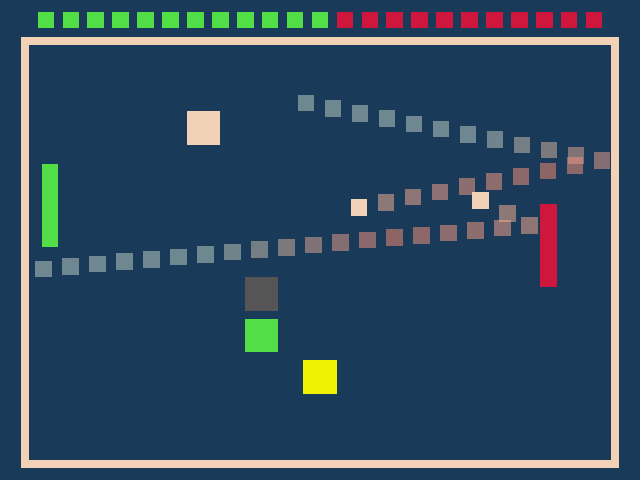

# Astroid Destroyer Pong

Author: Siheng Li

Design: There are now randomly spawning blocks in the game and the playing
field now shrinks when you hit the opposing wall to increase the difficulty.
Different blocks does different things: red and green provide points for the
corresponding team, yellow doubles the amount of balls, black deletes half
the balls, blue expands the playing field, and grey shrinks it.

Screen Shot:

How To Play:
Use the mouse to move the paddle up and down and prevent the AI
from hitting your wall.

Sources: 
Anything included in the base code

This game was built with [NEST](NEST.md).
